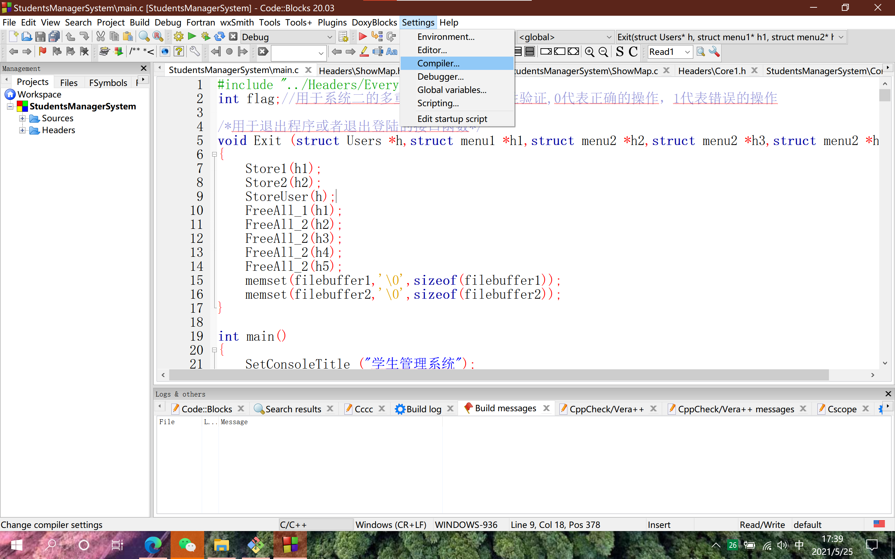
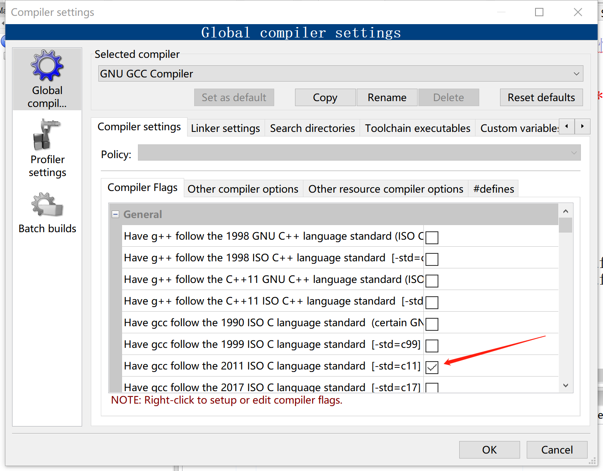
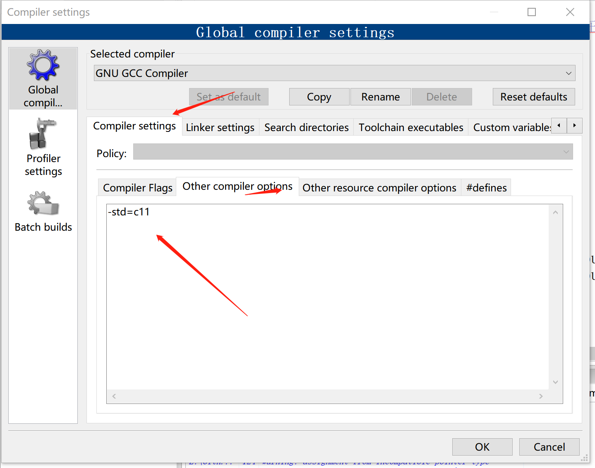

# -
# -
### 学生管理系统

**[演示视频和更多介绍](https://zhuanlan.zhihu.com/p/352197332)**

大一上所作，c语言，实现了登陆，文件读写，以及两个子系统，这分别包括学生成绩管理和学生信息管理，具体功能可以看看功能图。
亮点：

1. 作为大一单人的课设，代码量大，一个系统中有着两个子系统，代码超2000多行(虽然现在的我看这个代码觉得写了很多废话)

2. 有着较为完善的人机交互功能，基本上每个操作我都设置了返回和继续操作这个功能，给予用户较好的体验

3. 采用了登陆模式，允许修改密码，单账号数据存储在文件中

4. 数据结构强大，其中学生信息管理系统采用一颗AVL二叉树，学生成绩系统采用双向多重链表维护，较好的体现自己的水平
5. 自定义输入，使得可以检测用户在输入时的错误，例如输入数字时则不允许输入字符，且有范围规定。

6. 功能完善，创新设计

7. 代码模块化，分类定义了头文件与源文件，几乎未使用全局变量，虽然这样做可能传参比较复杂，但使项目模块化，可读性更高

头文件与函数定义：

1. FileO,h&&FileO.c，这个模块设计到了登陆与许多文件操作(File Operate)

2. Core1.h&&Core1.c,这个模块设计到了与学生信息管理系统有关的核心操作

3. Core2.h&&Core2.c,这个模块设计到了与学生成绩管理系统有关的核心操作

4. Input.h&&Input.c，这个模块自定义了输入，使得所有的输入均使用getch(在vs下并不支持，需要换成_gettch_)，使得在输入时便可以判定是否输入有效

5. ShowMap.h&&ShowMap.c，这个模块设计了与界面有关的函数

6. Everything.h,这个头文件包含了其他头文件，使得其他文件只需要包含这一个头文件就好了

### 一些可能会遇到的情况

如果遇到for-loop报错，请将codeblocks的编译条件换成c99或c11，否则程序将无法运行。

解决具体方法请参考下图：

1. 找到setting，点击Compiler...
2. 设置编译条件
3. 添加编译参数

 

 

ps: 其他IDE请自己谷歌解决。

